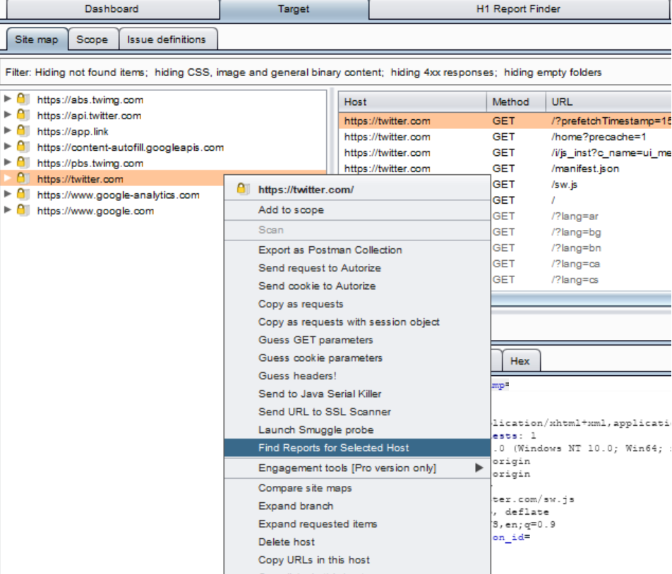

# H1 Report Finder

A burpsuite extension that helps security researchers find public security reports published on Hackerone corresponding to the selected host/url.

	

## Installation

  - Download [Jython](https://www.jython.org/download)
  - Add Jython binary path to Burp
  - Install the required python packcages
     ```sh
     cd jython/bin
     pip install -r requirements.txt
     ```
  - Load the extension into Burp
  - Happy Hacking

### Credits 
* Credits for the unofficial disclosure database goes to **DENIS WERNER** - [@NOBBD](https://twitter.com/nobbd?lang=en)


